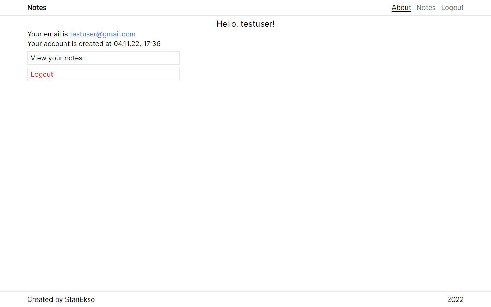
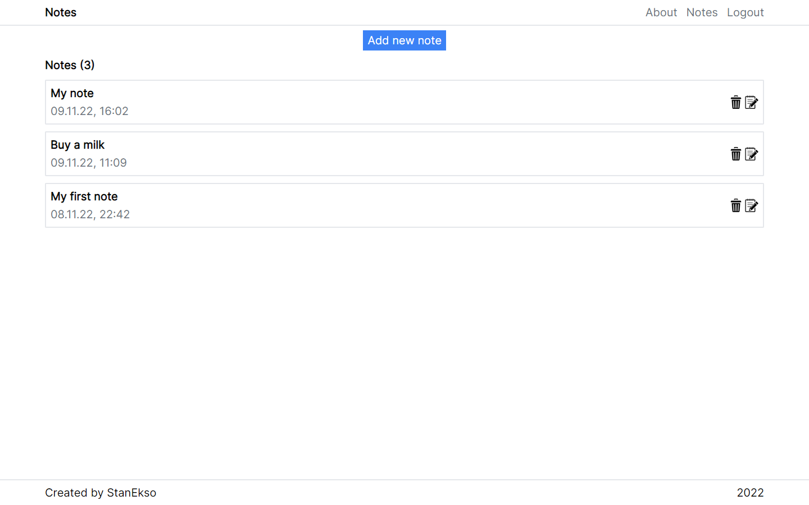

# React Notes App

This project is example of Notes Application using React.

## Preview on Desktop

## Technologies

- React
- React Hooks (and custom hooks)
- Typescript
- TailWind for styling
- React Router DOM for routing
- npm package json-server as pseudo-backend.

## Project Features

- 8 pages:
  - Register Page
  - Login Page
  - About Page
  - Notes List Page
  - Creation Note Page
  - Editing Note Page
  - View Note Page
  - 404 Custom Page
- Every user has his own notes.
  - Every note can be edited by it's owner.
  - Every note can be deleted by it's owner.
- Users can't see notes of each other.

## Local install

### Pre-requirements:

- Node and NPM installed on your device

### Installation

- Clone this repository
- Run `npm install` in cloned folder
- Run `npm run start`, `npm run start:db` to start project locally.
